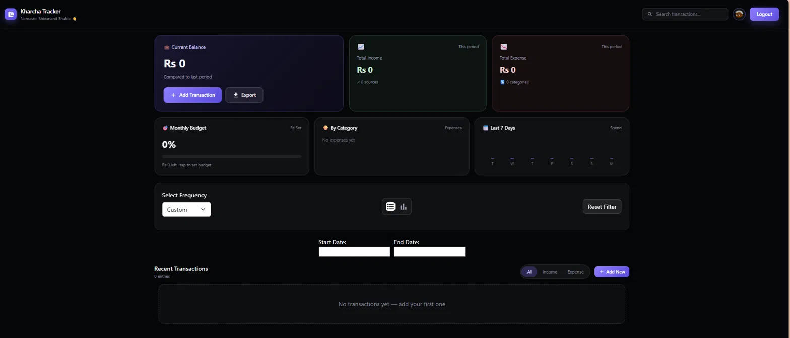
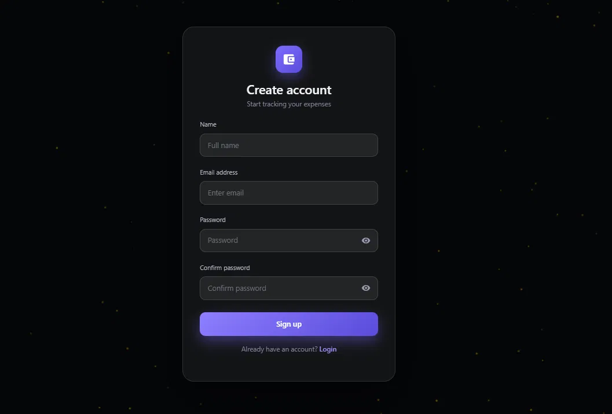
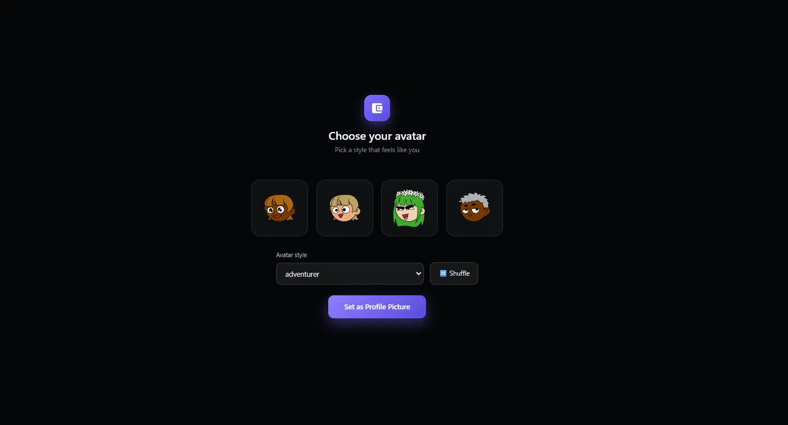

# 💰 Kharcha Tracker

<p align="center">
  
  
  
</p>

<p align="center">
A modern <b>Expense Tracking and Personal Finance Management System</b> built using the <b>MERN Stack</b> (MongoDB, Express.js, React.js, Node.js) — with a sleek dark glassmorphism UI, voice input, and receipt scanning.
</p>

---

## 📑 Table of Contents

- [About the Project](#-about-the-project)
- [Features](#-features)
- [Screenshots](#-screenshots)
- [Tech Stack](#-tech-stack)
- [Project Structure](#-project-structure)
- [Installation](#️-installation)
- [Environment Variables](#-environment-variables)
- [Application Workflow](#-application-workflow)
- [Deployment](#-deployment)
- [Future Enhancements](#-future-enhancements)
- [Developer](#-developer)
- [Contributing](#-contributing)
- [License](#-license)

---

## 📖 About the Project

Kharcha Tracker is a full-stack web application built to simplify personal finance management. Users can securely register, log in, add income and expense transactions, categorize records, filter data by date, and analyze their financial activity through an interactive dashboard.

The app follows the MERN Stack architecture for a fast, secure, and scalable experience — designed with a modern, responsive, dark-themed interface.

---

## ✨ Features

### 🔐 Authentication
- Secure registration and login
- Password strength indicator & show/hide toggle
- Custom avatar selection
- Protected routes

### 💳 Transaction Management
- Add, edit, and delete transactions
- Income & expense tracking with categories
- **Voice input** — add transactions hands-free using speech
- **Receipt scanning (OCR)** — auto-detect amount from a photo
- Full transaction history

### 📊 Dashboard
- Current balance, total income, total expenses
- Monthly budget tracker with progress bar
- Category-wise expense breakdown
- Last 7 days spending overview
- Recent transactions with search

### 📈 Analytics
- Income vs expense visual comparison
- Category-wise distribution charts
- Custom date range filtering

### 🔍 Filters
- Last 7 / 30 / 365 days
- Custom date range
- Income / Expense / All

### 📤 Export
- Download all transactions as CSV

### 📱 Responsive Design
- Optimized for mobile, tablet, and desktop

---

## 📸 Screenshots

<p align="center">
  
</p>
<p align="center"><i>Dashboard — balance, budget, and category overview</i></p>

<p align="center">
  
  &nbsp;&nbsp;
  
</p>
<p align="center"><i>Registration and avatar selection</i></p>

---

## 🛠 Tech Stack

**Frontend:** React.js, React Router DOM, Axios, React Bootstrap, Material UI Icons, React Datepicker, React Toastify, Tesseract.js (OCR), Web Speech API

**Backend:** Node.js, Express.js, JWT Authentication, REST API

**Database:** MongoDB Atlas, Mongoose

---

## 📂 Project Structure

```text
Kharcha-Tracker
├── frontend
│   ├── public
│   └── src
│       ├── assets
│       ├── components
│       ├── Pages
│       ├── utils
│       ├── App.js
│       └── index.js
├── backend
│   ├── config
│   ├── controllers
│   ├── middleware
│   ├── models
│   ├── routes
│   ├── utils
│   ├── app.js
│   └── server.js
├── screenshots
└── README.md
```

---

## ⚙️ Installation

### 1. Clone the repository

```bash
git clone https://github.com/Shivanand8546/Kharcha-Tracker.git
cd Kharcha-Tracker
```

### 2. Set up the backend

```bash
cd backend
npm install
```

Create `backend/config/config.env` (see [Environment Variables](#-environment-variables) below), then:

```bash
npm run dev
```

### 3. Set up the frontend

```bash
cd frontend
npm install
npm install tesseract.js
npm start
```

The app runs at `http://localhost:3000`, connecting to the backend at `http://localhost:5000`.

---

## 🔑 Environment Variables

Create a `config/config.env` file inside the `backend` folder:

```env
PORT=5000
MONGO_URL=YOUR_MONGODB_CONNECTION_STRING
```

---

## 🚀 Application Workflow

```text
User Registration/Login
          │
          ▼
      Dashboard
          │
          ▼
 Add Income / Expense
   (manual, voice, or receipt scan)
          │
          ▼
 Save Transaction → MongoDB
          │
          ▼
 View Dashboard, Budget & Analytics
```

---

## 🌍 Deployment

| Layer | Suggested Platforms |
|---|---|
| Frontend | Vercel, Netlify, AWS Amplify |
| Backend | Render, Railway |
| Database | MongoDB Atlas |

---

## 🔮 Future Enhancements

- [ ] Export reports as PDF
- [ ] Recurring transactions
- [ ] Dark/Light mode toggle
- [ ] Email notifications
- [ ] Multi-currency support
- [ ] AI-based spending insights

---

## 👨‍💻 Developer

**Shivanand Shukla**
B.Tech — Computer Science Engineering, KIET Group of Institutions

[](https://shivanandshukla.me)
[](https://github.com/Shivanand8546)
[](https://www.linkedin.com/in/shivnand21)

---

## 🤝 Contributing

Contributions are welcome! If you find a bug or have a suggestion:

1. Fork the repository
2. Create a new branch (`git checkout -b feature/your-feature`)
3. Commit your changes
4. Push and open a Pull Request

---

## 📄 License

This project is licensed under the **MIT License**.

© 2026 Shivanand Shukla. All Rights Reserved.
